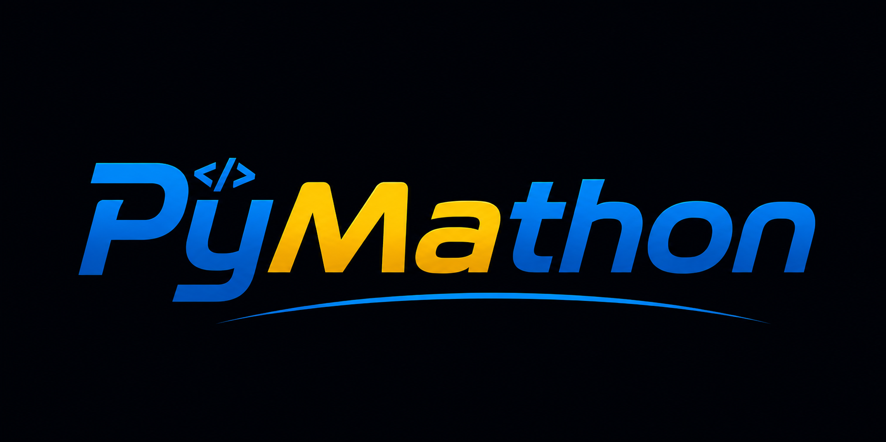

::: {.about-hero}
::: {.about-photo}
{.about-logo}
:::

::: {.about-intro}
## Ashish K. Srivastava

I am a mathematics enthusiast and curious problem solver who enjoys exploring ideas with clarity, structure, and creativity.

Through PyMathon, I combine classical reasoning with modern computational tools such as Python, SymPy, NumPy, Matplotlib, and Manim. My aim is to explain ideas clearly, rigorously, and visually while preserving the discipline of traditional step-by-step problem solving.
:::
:::

## Main Interests

- JEE Problem Solving
- Algebra
- Calculus
- Coordinate Geometry
- Combinatorics
- Number Theory
- Python for Problem Solving
- Visualisation
- Manim

## Why I Created PyMathon

I created PyMathon as a place where problem solving and Python can strengthen one another. Here, I want to:

- connect ideas with Python;
- present multiple approaches to a problem;
- verify results computationally;
- produce clear visual explanations; and
- help students and teachers explore concepts more deeply.

The goal is not merely to arrive at an answer. It is to understand why the answer is correct, see how different ideas are connected, and use computation to investigate those ideas further.

## My Teaching Philosophy

I believe that **understanding must come before memorisation**. A formula becomes truly useful only when a student understands where it comes from and when it applies.

Traditional step-by-step reasoning remains central to my teaching. I encourage students to write complete arguments, examine more than one solution method, and develop a visual understanding wherever possible. Algebraic, geometric, combinatorial, and computational viewpoints can often illuminate different parts of the same problem.

I use computation responsibly: Python can test examples, reveal patterns, verify calculations, and create illuminating visualisations, but it should support mathematical proof rather than replace it.

## Connect

- **Email:** [kumarashish3066@gmail.com](mailto:kumarashish3066@gmail.com)
